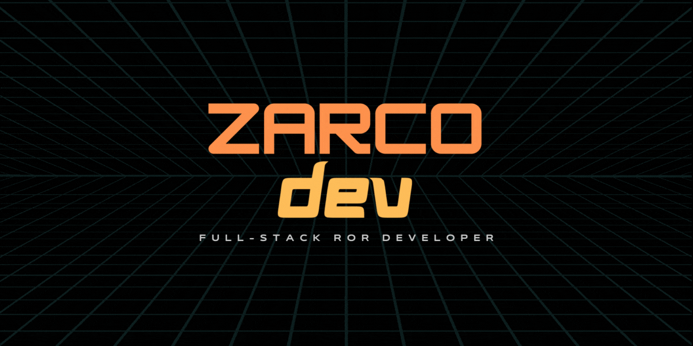

# Hello World!

### Soy Sebas 🧒🏼, Full-Stack RoR Developer 🔸 y TA at Le Wagon . Desarrollo aplicaciones web desde el back-end, usando Ruby y su framework Rails y bases de datos empleando PostgreSQL; hasta el front-end utilizando HTML5, CSS con su framework Bootstrap y JavaScript (Stimulus).

### Empleo GIT para el control de versiones, repositorios como GitHub y Bitbucket y Heroku para el despliegue de los aplicativos. También he tenido la oportunidad de aplicar metodologías ágiles como Scrum en proyectos universitarios. Soy apasionado por el aprendizaje continuo y la enseñanza 💛.

   

## Habilidades y tecnologías

 

| Back-end | Front-end | BD | Cloud | Control Version |
| :------: | :-------: | :-: | :--: | :----------------------------: |
| |  |  |  | 
| |  |  |  | 
| |  |  |  | 
| | 
| | 

   

## Proyectos Recientes

-------------------------------------------------
###  Aegis: https://managemypass.herokuapp.com/
--------------------------------------------------
###  FastBox: http://fastboxdelivery.herokuapp.com/
---------------------------------------------------

   

## Contáctame

 

